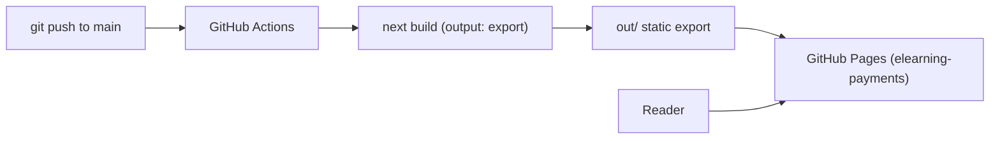

# nextjs-tailwind-migration - Architecture

## What This Phase Adds

No new containers or datastores. Phase 2 makes the existing `academy.web` container's implementation
match its already-modeled description (Next.js + Tailwind) and brings the CI build/deploy path online:

- `academy.web` — technology already reads "Next.js (App Router, output: export) + Tailwind CSS";
  Phase 2 is when the code catches up to the model.
- `ci -> academy.web` — the "builds and deploys to" relationship, currently tagged `#planned`,
  becomes real (2.5). `ci -> db` and `ci -> backup` stay `#planned` (Phase 3/4).

## Model Changes

- Remove `#planned` from the `ci -> web` build/deploy relationship (it ships in 2.5).
- No new elements: `web`, `ci`, `pages`, `fonts`, `resources` already exist; `content` and
  `browserStorage` stay `#prototype` until Phase 3 retires them.
- Resolve a pre-existing drift: `web`'s technology description has read "Next.js" since the model
  was written while the running code was still the vanilla-JS prototype; Phase 2 makes them agree.

## View

Add a `phase2` view (in the existing `views` block of `architecture/model.c4`) showing
`academy.web`, `ci`, `pages`, `fonts`, `resources`, and the `ci -> web` and `pages -> web`
relationships — the slice this phase touches.

## Flow

