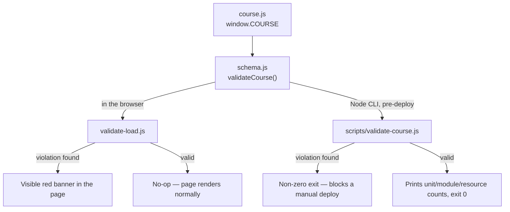

# schema-content-validation - Architecture

## What This Phase Adds

Nothing structural. Phase 1, and this backfill/fix pass on it, are dev-time tooling layered on top
of the existing `academy.content` element already modeled in `architecture/model.c4`:

- `schema.js` - a shared validator function, not a runtime container, actor, or data store.
- `validate-load.js` - a browser-side check that reads `window.COURSE` and renders a banner; it
  runs inside the existing `academy.web` container and introduces no new one.
- `scripts/validate-course.js` - a Node CLI script invoked by a human before deploy; it has no
  running counterpart in production and is not part of what's served to the reader.

None of these cross a system boundary the C4 model tracks (no new actor, container, or datastore),
so none earn a new model element.

## Model Changes

None. `architecture/model.c4` is unchanged by this phase. This is confirmed deliberately here,
rather than assumed - `TODO.md`'s 2026-09-16 audit specifically asked that this reasoning be
checked explicitly next time rather than taken for granted, since the original Phase 1 commit
touched everything except the model file.

## View

No new view is needed. The existing `current` view in `architecture/model.c4` already includes
`academy.content` (tagged `#prototype`), which is the element the validator checks against. There
is nothing this phase adds that a reader of that view would need to see.

## Flow

